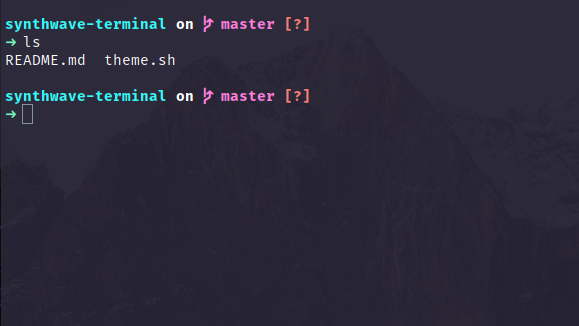

# SynthWave 2084 - Elementary OS Terminal Theme

## Getting Started

[SynthWave '84](https://github.com/robb0wen/synthwave-vscode) is one of my favorite vscode theme, providing a beautiful and vivid color pallet to the code. This repo is an adaptation of the [SynthWave '84](https://github.com/robb0wen/synthwave-vscode) colors to the Elementary OS (Pantheon) terminal.

**Be aware, this is a work in progress**, an far from being a serius one... but actually works.




### Prerequisites

- [Elementary OS](https://elementary.io/) (5.1 Hera);

- dconf-tools (3.28.0)

- [Fira code](https://github.com/tonsky/FiraCode)

### Installing

Just run the `theme.sh` shell script in your favorite bash (i am using zsh).

```
git clone https://github.com/giu7d/synthwave-terminal.git
cd synthwave-terminal
sh theme.sh
```

**Obs:** Maybe you'll need to restart your terminal...

and that is it.

### Glow

**No glow... sorry...**
